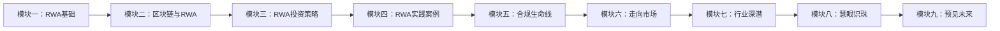

# 课程概述

## 学习路径

本平台提供的RWA课程体系分为九个核心模块，旨在帮助您全面掌握实物资产代币化的知识和技能。

## 模块介绍

### 第一部分：RWA 认知与价值基础

#### 模块一：RWA基础
- RWA定义与分类
- 传统资产与代币化资产的区别
- RWA市场现状与发展趋势
- 监管环境与合规要求

#### 模块二：区块链与RWA
- 区块链技术基础
- 智能合约与资产代币化
- 代币标准（ERC-20, ERC-721, ERC-1155等）
- 去中心化金融(DeFi)与RWA集成

### 第二部分：项目运作全景

#### 模块三：RWA投资策略
- RWA投资基本原则
- 风险评估与管理
- 投资组合构建
- 投资时机与策略

#### 模块四：RWA实践案例
- 成功的RWA项目案例分析
- 行业趋势分析
- 行业挑战与解决方案
- 未来展望

#### 模块五：合规生命线
- RWA 代币定性与影响
- 主要法域监管概览
- 跨境合规解决方案
- KYC/AML 与数据隐私

#### 模块六：走向市场
- 持续运营与信息披露
- 市场营销与品牌
- 社区建设策略
- 投资者关系管理

### 第三部分：应用与未来展望

#### 模块七：行业深潜
- 房地产 RWA 案例分析
- 艺术品与收藏品 RWA 案例
- 债权 RWA 案例分析
- 碳信用与其他创新 RWA 案例

#### 模块八：慧眼识珠
- RWA 投资框架
- 风险识别与管理
- 尽职调查实务
- 投资决策框架

#### 模块九：预见未来
- 技术与监管趋势
- 市场与创新机遇
- 创新前沿案例
- 未来展望与战略思考

## 课程特色

- **系统全面**：从基础概念到高级应用，构建完整知识体系
- **实践导向**：大量案例分析和实操指南，理论联系实际
- **前沿视角**：紧跟行业最新发展，洞察未来趋势
- **互动学习**：思考问题和练习，加深理解和应用

开始您的 RWA 学习之旅吧！

[开始学习：模块一 - RWA基础](./module1.md){ .md-button .md-button--primary }组合构建与优化
- 流动性管理与退出策略

### 模块四：RWA实践案例
- 房地产代币化案例
- 商业贷款代币化案例
- 碳信用额度代币化案例
- 艺术品与收藏品代币化案例

## 学习目标

完成本课程后，您将能够：

- ✅ 理解RWA的核心概念和价值主张
- ✅ 掌握区块链技术在资产代币化中的应用
- ✅ 评估不同类型的RWA投资机会
- ✅ 设计和实施RWA代币化项目
- ✅ 制定适合自身需求的RWA投资策略

## 证书与认证

完成所有模块的学习后，您将获得由METAKINA颁发的RWA专业知识证书，证明您在实物资产代币化领域的专业水平。

## 开始学习

准备好开始您的学习之旅了吗？点击下方按钮进入第一个模块！

[进入模块一：RWA基础](./module1.md){ .md-button .md-button--primary }
