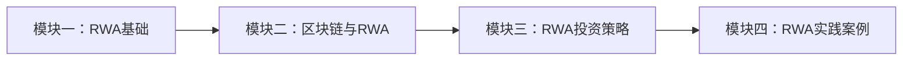

# 课程概述

## 学习路径

本平台提供的RWA课程体系分为四个核心模块，旨在帮助您全面掌握实物资产代币化的知识和技能。

## 模块介绍

### 模块一：RWA基础
- RWA定义与分类
- 传统资产与代币化资产的区别
- RWA市场现状与发展趋势
- 监管环境与合规要求

### 模块二：区块链与RWA
- 区块链技术基础
- 智能合约与资产代币化
- 代币标准（ERC-20, ERC-721, ERC-1155等）
- 去中心化金融(DeFi)与RWA集成

### 模块三：RWA投资策略
- RWA投资基本原则
- 风险评估与管理
- 投资组合构建与优化
- 流动性管理与退出策略

### 模块四：RWA实践案例
- 房地产代币化案例
- 商业贷款代币化案例
- 碳信用额度代币化案例
- 艺术品与收藏品代币化案例

## 学习目标

完成本课程后，您将能够：

- ✅ 理解RWA的核心概念和价值主张
- ✅ 掌握区块链技术在资产代币化中的应用
- ✅ 评估不同类型的RWA投资机会
- ✅ 设计和实施RWA代币化项目
- ✅ 制定适合自身需求的RWA投资策略

## 证书与认证

完成所有模块的学习后，您将获得由METAKINA颁发的RWA专业知识证书，证明您在实物资产代币化领域的专业水平。

## 开始学习

准备好开始您的学习之旅了吗？点击下方按钮进入第一个模块！

[进入模块一：RWA基础](./module1.md){ .md-button .md-button--primary }
